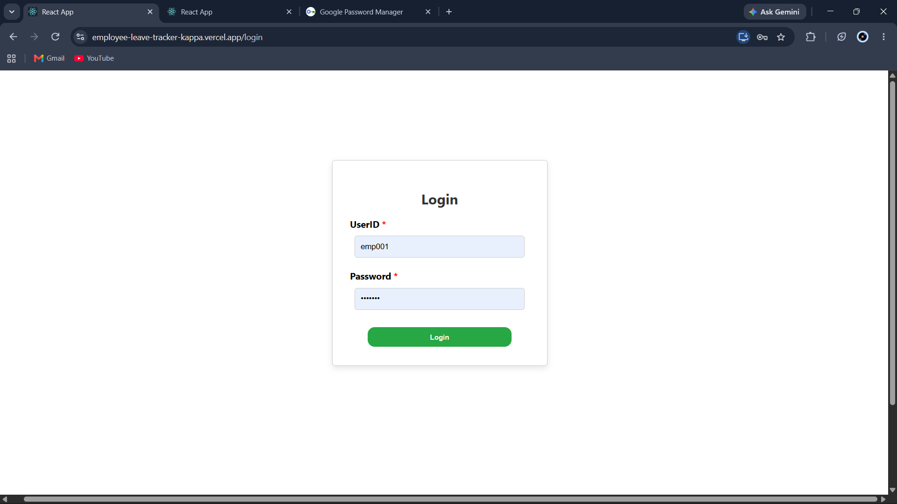
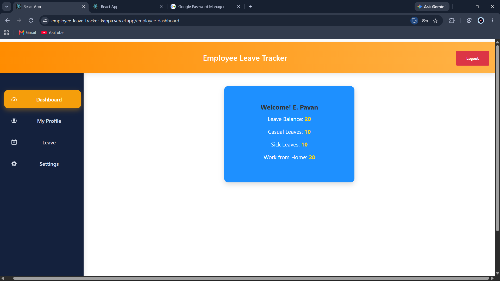
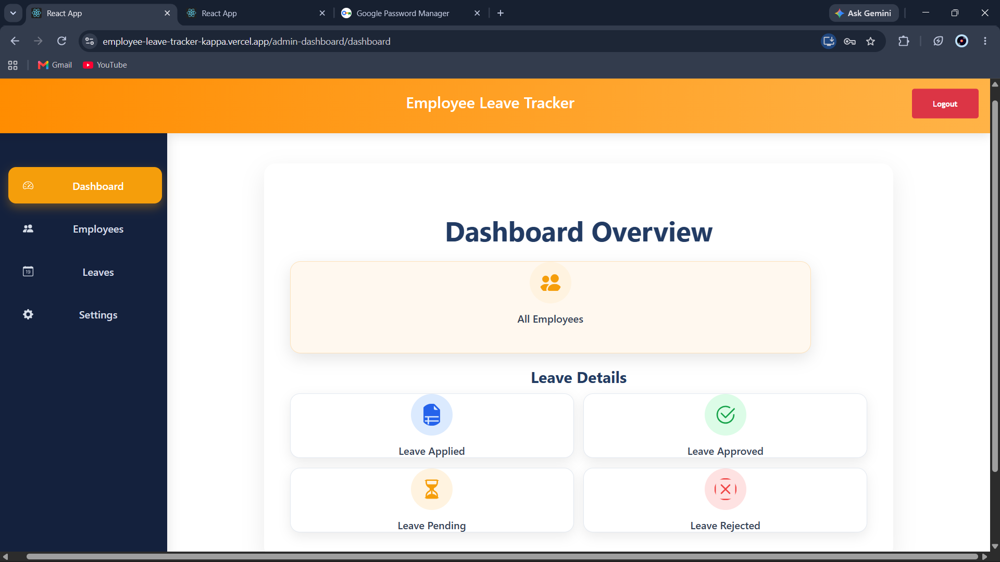
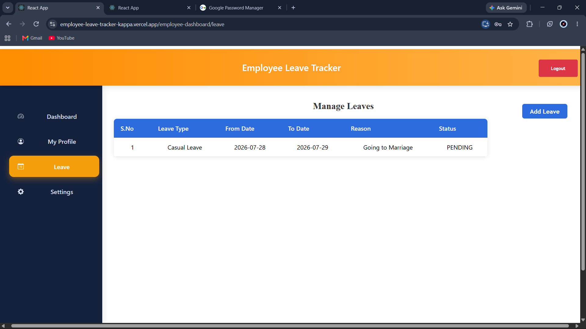
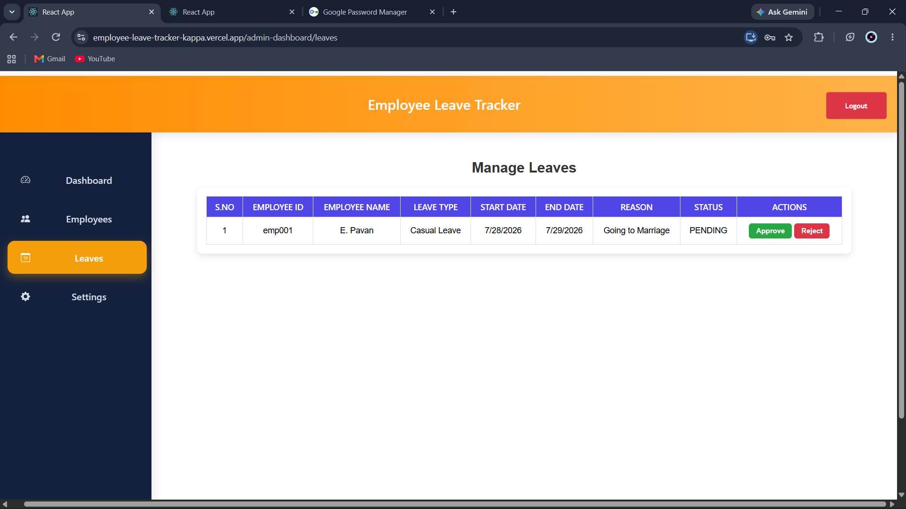

# Employee Leave Tracker

A full-stack **Employee Leave Management System** that enables employees to apply for leave and administrators to manage leave requests through a secure web application.

---

## 🌐 Live Demo

- **Frontend:** https://employee-leave-tracker-kappa.vercel.app
- **Backend:** https://employeeleave-backend-qeh6.onrender.com

---

## ✨ Features

### Employee Module

- Secure Login
- Employee Dashboard
- View Profile
- Apply for Leave
- View Leave History
- Track Leave Status
- Change Password

### Admin Module

- Secure Login
- Dashboard Overview
- View All Employees
- View Leave Requests
- Approve Leave Requests
- Reject Leave Requests
- Change Password

---

## 🛠️ Tech Stack

### Frontend

- React.js
- React Router
- Axios
- HTML5
- CSS3

### Backend

- Java 21
- Spring Boot 3
- Spring Data JPA
- RESTful APIs
- Maven

### Database

- PostgreSQL

### Deployment

- Frontend: Vercel
- Backend: Render
- Database: Render PostgreSQL

---

## 📂 Project Structure

```text
EmployeeLeaveTracker/
│
├── frontend/
│   ├── src/
│   ├── public/
│   └── package.json
│
├── backend/
│   ├── src/
│   ├── pom.xml
│   └── Dockerfile
│
├── screenshots/
│
└── README.md
```

---

## 🚀 Installation

### Clone the Repository

```bash
git clone https://github.com/pa1-111/EmployeeLeaveTracker.git
cd EmployeeLeaveTracker
```

### Backend Setup

```bash
cd backend
mvn spring-boot:run
```

### Frontend Setup

```bash
cd frontend
npm install
npm start
```

---

## 🔗 API Base URL

```
https://employeeleave-backend-qeh6.onrender.com
```

---

## 🖥️ Screenshots

### Login Page



---

### Employee Dashboard



---

### Admin Dashboard



---

### Apply Leave



---

### Leave Approval



---

## 🏗️ System Architecture

```text
                 React.js (Frontend)
                      │
                 Axios REST API
                      │
          Spring Boot REST Backend
                      │
                 PostgreSQL Database
```

---

## 🔮 Future Enhancements

- JWT Authentication
- Email Notifications
- Leave Balance Calculation
- Attendance Management
- Payroll Integration
- Role-Based Authorization
- Dark Mode Support
- Admin Analytics Dashboard

---

## 👨‍💻 Author

**Pavan**

- **GitHub:** https://github.com/pa1-111
- **LinkedIn:** https://www.linkedin.com/in/pavan-etteboina-bb6612224/

---
